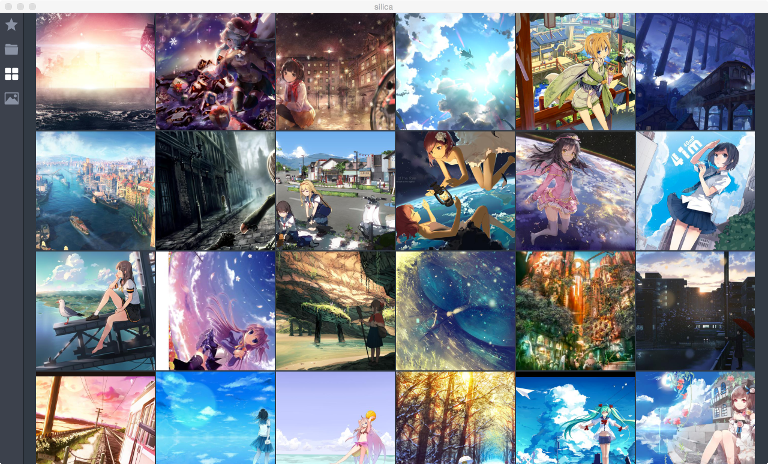

# Silica
An image viewer.

# Screenshots



# Features

* View images inside ZIP, RAR and 7-zip archives directly
* Manga mode
* Vim like keybindings
* Hardward accelerated graphics
* Gamepad support

# Dependencies

* Qt 5.15 (with schannel)
* OpenCV

# Build

Silica uses CMake for building.

## Linux / OS X

```shell
$ git clone --recurse-submodules https://github.com/ArchangelSDY/Silica.git
$ mkdir build
$ cd build
$ cmake ../Silica
$ make -j
```

If you want a production build, set `CMAKE_BUILD_TYPE=Release` and `BUILD_PRODUCTION=ON`.
A production build will store profile files in `~/.config/Silica` instead of `~/.config/Silica-Dev` in development build.

```shell
$ cmake ../silica -DCMAKE_BUILD_TYPE=Release -DBUILD_PRODUCTION=ON
```

By default, OpenGL is disabled, you can enable it by setting `ENABLE_OPENGL=ON`.

```shell
$ cmake ../silica -DENABLE_OPENGL=ON
```

Finally, you can make distribution packages after build via:

```shell
$ make package
```

## Windows

```batch
git clone --recurse-submodules https://github.com/ArchangelSDY/Silica.git
mkdir build
cd build
cmake -G "Visual Studio 16 2019 Win64" -DCMAKE_PREFIX_PATH=<QT_ROOT> -DOpenCV_DIR=<OpenCV_ROOT> -DOpenCV_STATIC=true ..\Silica
cmake --build . --config Debug
```

# License
GPL v3.
